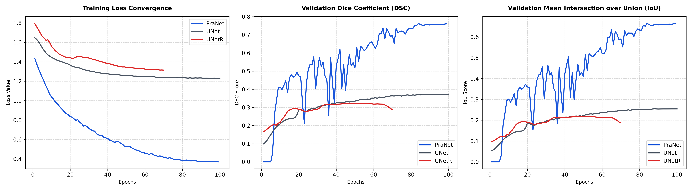
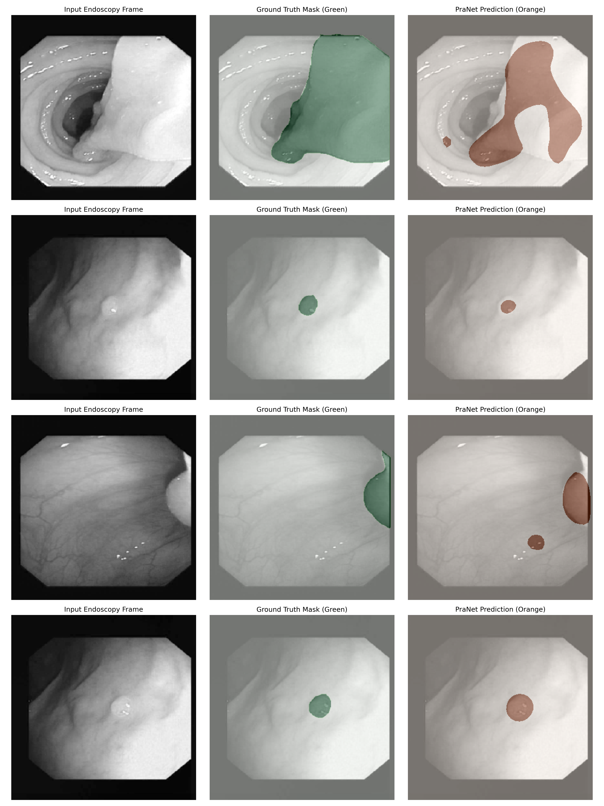
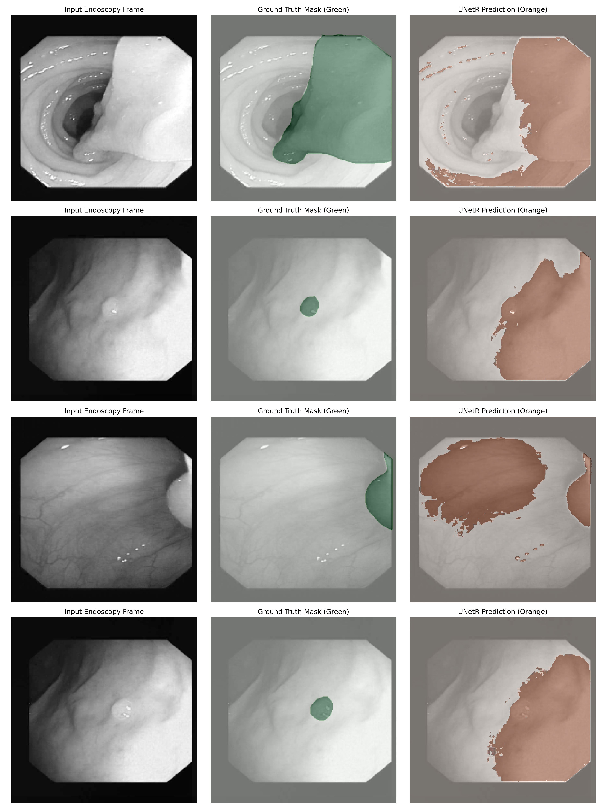
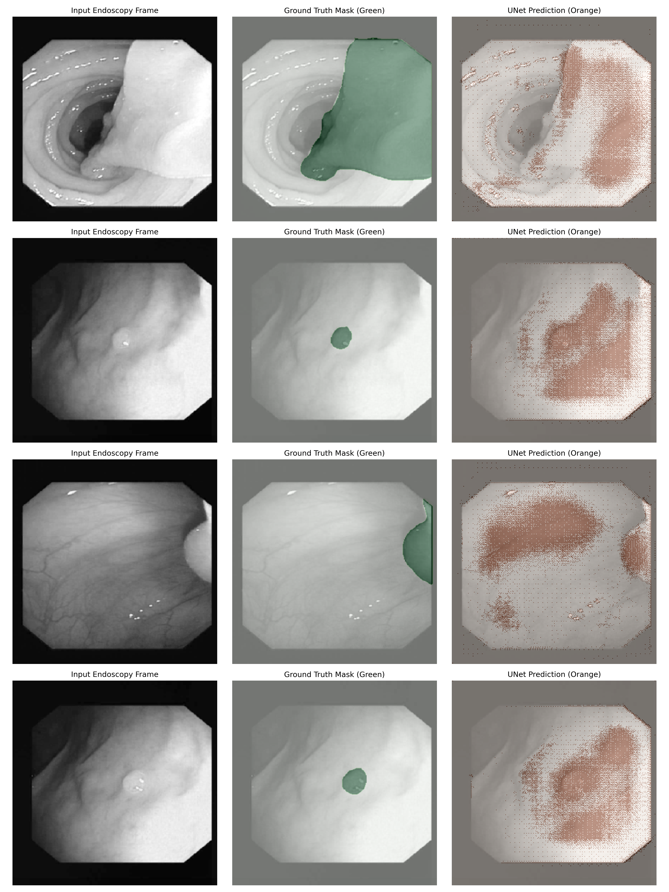
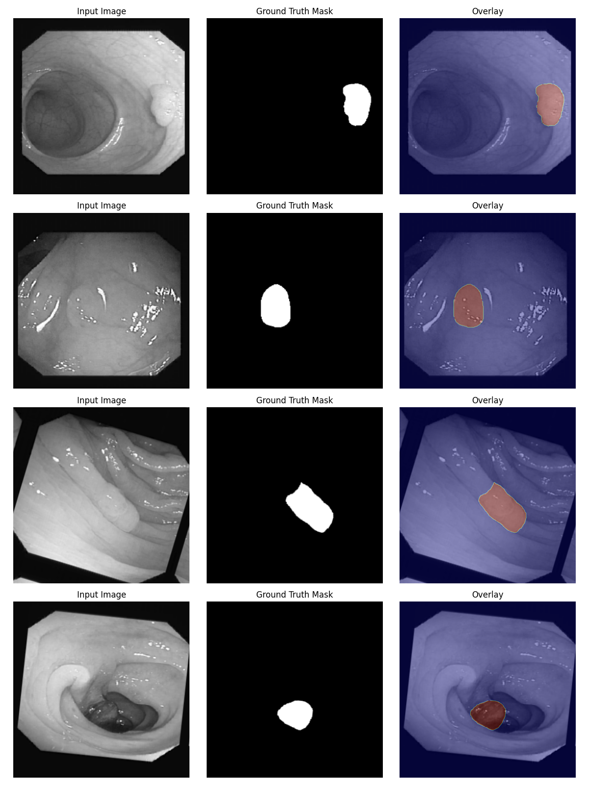

# Endoscopy Polyp Segmentation

 

This project is a pure-PyTorch implementation comparing classical convolutional, transformer-based, and parallel reverse-attention architectures for semantic polyp segmentation in multi-source gastrointestinal endoscopy videos.

______________________________________________________________________

## 1. Performance Diagnostics & Comparative Analysis

To evaluate the generalization boundaries of modern segmentation paradigms on specialized medical domains, we conducted a benchmark across three distinct architectural branches: **PraNet** (Parallel Reverse Attention with Res2Net-50 backbone), **UNet** (fully convolutional, trained from scratch), and **UNetR** (Vision Transformer with convolutional skip-connections, trained from scratch).

### Quantitative Evaluation

The quantitative metrics recorded across the training and validation cycles are visualized in the comparative convergence plots below:

<p align="center">

</p>

| Model Architecture | Parameter Count | Validation DSC (Best) | Validation IoU (Best) | Convergence Behavior (Epochs) |
| :--- | :---: | :---: | :---: | :---: |
| **PraNet (Res2Net Backbone)** | **24.48 M** | **0.7628** | **0.6711** | **Stable (Optimal @ Epoch 98)** |
| **UNet (From Scratch)** | 1.83 M | 0.3722 | 0.2541 | Asymptotic Plateau (@ Epoch 60) |
| **UNetR (From Scratch)** | 105.32 M | 0.2941 | 0.1895 | Early Stopped (@ Epoch 70) |

______________________________________________________________________

### Qualitative Visual Analysis

To understand *where* and *why* these models succeed or fail, we analyze their inference outputs on validation frames:

#### A. PraNet: Edge-Aware High-Fidelity Segmentation

<p align="center">

</p>

- **Observations**: `PraNet` generates crisp, continuous, and highly accurate segmentation boundaries mapping strictly to the true polyp geometry (even on highly challenging flat or small polyps, as seen in row 2 and 4).
- **Architectural Mechanics**: This precision is directly attributed to its multi-scale **Parallel Partial Decoder (PPD)** and **Reverse Attention (RA)** modules. The PPD aggregates high-level semantic features to generate a coarse global prediction map. The RA modules then progressively mask out the predicted foreground region, forcing the network to inspect the remaining background transition zones. This acts as a boundary-refining loop that progressively cleans up transitional noise.

#### B. UNetR: Coarse, Blocky Spatial Discretization

<p align="center">

</p>

- **Observations**: `UNetR` fails to capture exact edges, producing blocky, staircase-like boundary segmentations that bleed excessively into adjacent background tissues (prominent in rows 1 and 3).
- **Architectural Mechanics**: Because `UNetR` utilizes a standard Vision Transformer (ViT) encoder, the input frames are projected into discrete $16 \\times 16$ spatial token patches. At early training stages without mature attention maps, the model loses sub-patch resolution detail. Even with convolutional skip-connections in the decoder, it struggles to recover precise local boundary coordinates on moderate data volumes, leading to generalized, blocky predictions.

#### C. UNet: High-Frequency Spatial Noise & Salt-and-Pepper Activations

<p align="center">

</p>

- **Observations**: `UNet` predictions suffer from severe pixel-level fragmentation, displaying "salt-and-pepper" noise, disjointed spatial islands, and a complete failure to formulate cohesive semantic boundaries.
- **Architectural Mechanics**: Lacking pre-trained spatial feature priors, the shallow convolutional filters of the UNet are highly sensitive to high-frequency color variations and specular reflections (typical of endoscopic light sources). Without global attention or receptive field blocks to enforce spatial consistency, the model emits uncoordinated pixel-wise predictions, treating individual pixels as disjointed classification targets rather than unified semantic structures.

______________________________________________________________________

### Pre-Training Visual Diagnostics

To ensure spatial alignment before running compute-heavy training loops, the pipeline generates automated preprocessing overlays. Below are representative samples verifying proper spatial, channel, and normalization mapping across multi-source data inputs:

<p align="center">

</p>

______________________________________________________________________

## 2. Core Features

- **On-the-Fly OpenCV Dataset Standardizer**: Integrates an advanced preprocessing pipeline that uses statically compiled OpenCV bindings to decode medical TIFF, JPEG, and PNG files natively, bypassing local Pillow limits and converting them to standardized, 1-channel grayscale lossless `.png` structures.
- **Hardware-Saturated DataLoaders**: Utilizes MONAI's `CacheDataset` to bypass disk read bottlenecks.
- **Automatic Multi-GPU Scaling**: Dynamically detects hardware topology. If multiple GPUs are detected, the model is wrapped in `torch.nn.DataParallel` to distribute training batches.
- **BFloat16 Mixed Precision**: Uses native `torch.autocast(dtype=torch.bfloat16)` to optimize VRAM footprint and training throughput without requiring a `GradScaler`.
- **Strict Parameter-Grouped Optimization**: Employs AdamW optimization paired with a progressive `LinearLR` warmup phase transitioning into `CosineAnnealingLR` decay via a `SequentialLR` scheduler.

______________________________________________________________________

## 3. Domain Context

This project pools 5 diverse endoscopy datasets: **Kvasir-SEG**, **CVC-ClinicDB**, **CVC-ColonDB**, **ETIS-LaribPolypDB**, and **CVC-300**. These datasets present extreme class imbalances, varying aspect ratios, and specularity artifacts.

The pipeline handles these challenges by mapping all masks natively to 1-channel grayscale on disk, and optimizing them via a weighted **`DiceCELoss`** to combat extreme class imbalances (foreground polyps vs. dominant background tissues).

______________________________________________________________________

## 4. Getting Started

### Installation

```bash
# Clone the repository
git clone https://github.com/abderrahmenex86/Polyp-Segmentation
cd Polyp-Segmentation

# Install dependencies
pip install -r requirements.txt
```

______________________________________________________________________

## 5. CLI Execution Workflows

### 1. Hardware Profiling

*Determine the maximum batch size your GPU can safely support without triggering an Out-Of-Memory (OOM) error.*

```bash
python main.py --profile --architecture PraNet --image_height 352 --image_width 352
```

### 2. Full Training Pipeline

*Execute training with specified architectures and pre-trained weights.*

```bash
python main.py --train \
--architecture PraNet \
--batch_size 16 \
--epochs 100 \
--warmup_epochs 10 \
--dataset_directory dataset \
--backbone_weights weights/Res2Net50_26w_4s.pth \
--pranet_weights weights/PraNet.pth
```

### 3. Model Testing

*Evaluate your serialized model against the held-out test split.*

```bash
python main.py --test --run_dir artifacts/20260702_051722_PraNet
```

### 4. Smart Inference

*Execute forward passes on raw, unlabeled endoscopy frames.*

```bash
python main.py --infer --inference_dir dataset/unlabeled --run_dir artifacts/20260702_051722_PraNet
```

### 5. Multi-Run Comparative Plotting

*Compare and generate comparative curves for all runs in the `artifacts/` directory.*

```bash
python tools.py --mode plot
```
